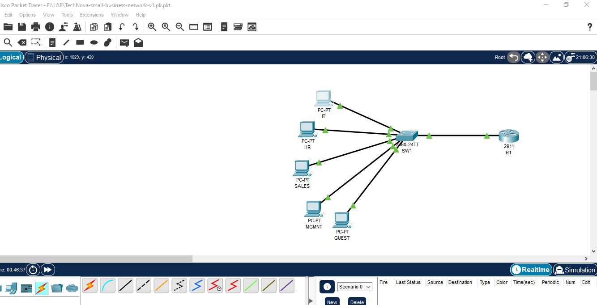
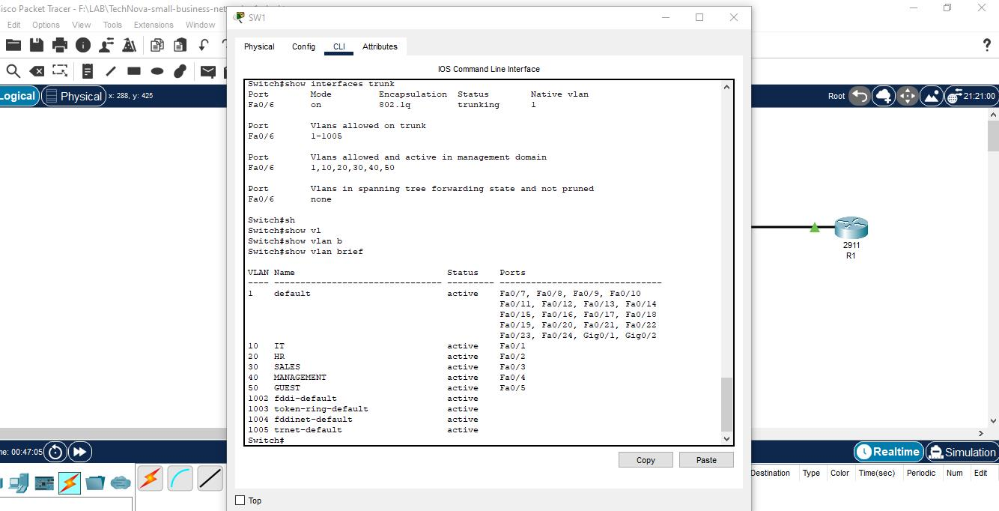
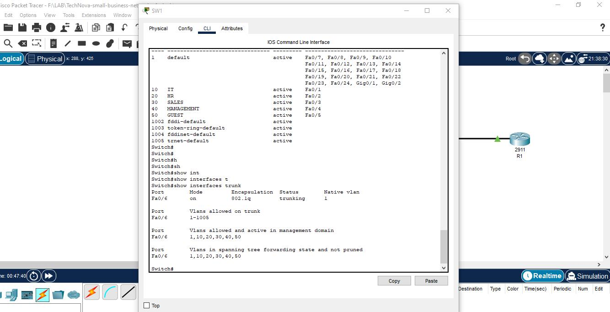
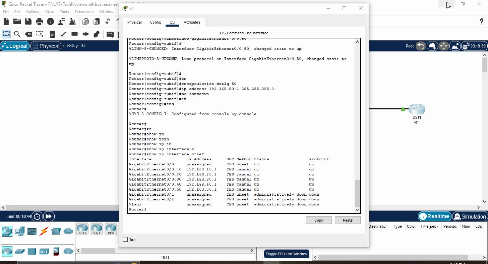
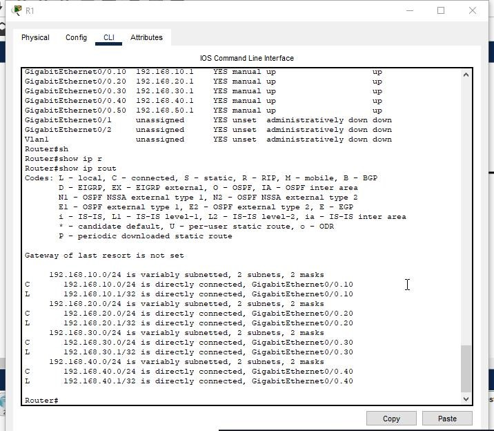
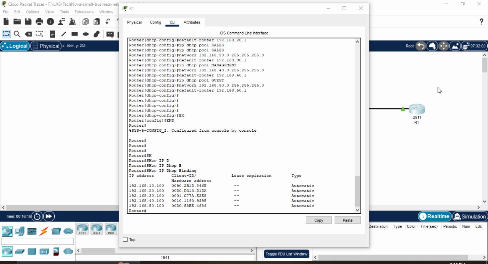
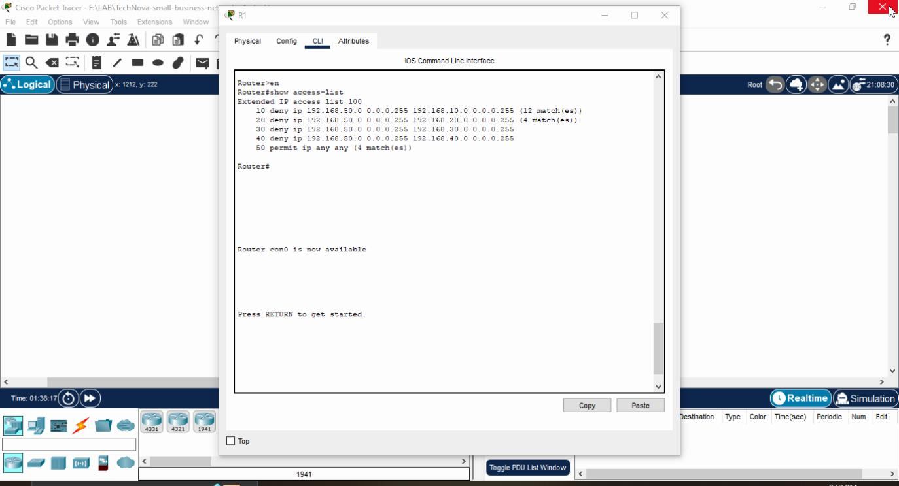
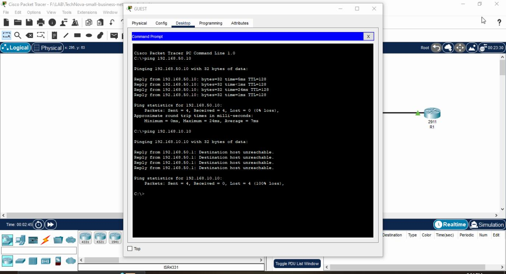
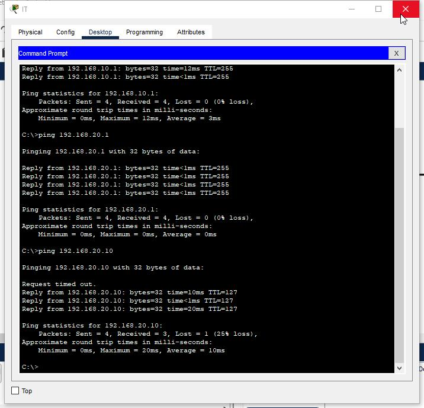

# Small Business Network Design & Implementation

A practical Cisco networking project designed and implemented in Cisco Packet Tracer.

## Project Overview

This project demonstrates the design and implementation of a small business network using VLAN segmentation, Inter-VLAN routing, DHCP, and ACL-based security.

## Network Architecture

The network consists of five VLANs:

| VLAN | Department | Network | Gateway |
|---|---|---|---|
| 10 | IT | 192.168.10.0/24 | 192.168.10.1 |
| 20 | HR | 192.168.20.0/24 | 192.168.20.1 |
| 30 | Sales | 192.168.30.0/24 | 192.168.30.1 |
| 40 | Management | 192.168.40.0/24 | 192.168.40.1 |
| 50 | Guest | 192.168.50.0/24 | 192.168.50.1 |

## Technologies Used

- Cisco Packet Tracer
- VLAN
- 802.1Q Trunking
- Inter-VLAN Routing
- Router-on-a-Stick
- DHCP
- Extended ACL
- IPv4

## Security

An Extended ACL was configured on the Guest VLAN to prevent Guest users from accessing internal VLANs.

Guest users are isolated from:

- IT
- HR
- Sales
- Management

At the same time, Guest users can communicate with their own default gateway.

## DHCP

The router provides DHCP services for all five VLANs.

Each VLAN receives IP addressing dynamically from its corresponding DHCP pool.

## Verification

The following tests were performed:

- VLAN connectivity
- Inter-VLAN routing
- DHCP address assignment
- ACL security
- Guest network isolation
- Successful and blocked ping tests

## Project Files

- Cisco Packet Tracer project: `.pkt`
- Network topology screenshots
- Configuration and verification screenshots

## Skills Demonstrated

This project demonstrates practical skills in:

- Network segmentation
- IP addressing
- Cisco routing and switching
- Network security
- DHCP configuration
- ACL configuration
- Network troubleshooting
  

## Screenshots

### Network Topology

### VLAN Configuration

### Trunk Configuration

### IP Configuration

### Interface Status

### Routing Table

### DHCP Bindings

### ACL Configuration

### ACL Security Test

### IP Details

